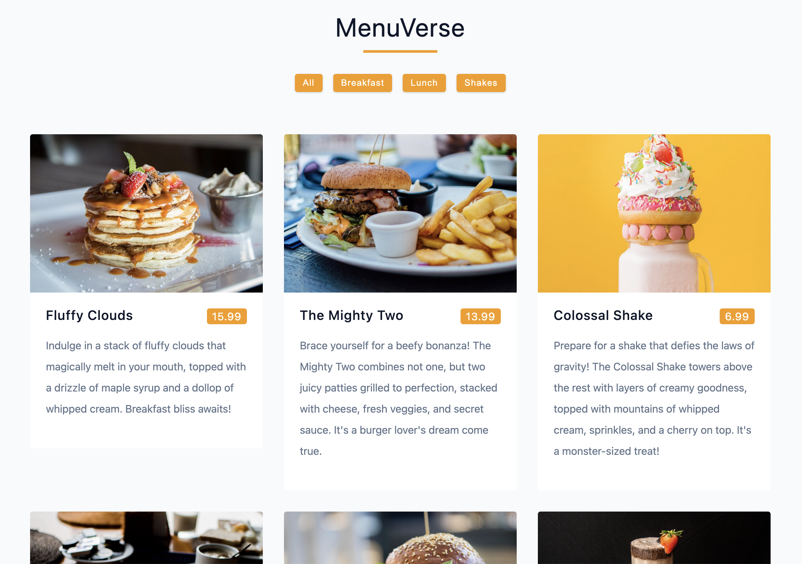

## MenuVerse App

The `MenuVerse` project is a React-based web application that showcases a dynamic menu interface. It allows users to explore a variety of food items, their prices, descriptions, and images. Users can filter the menu items based on different categories and easily navigate through the menu. 

